# Awesome Civic Tech Projects

Im Rahmen des Projekts Digifarm.ms wurde eine Liste mit Open-Source-Projekten erstellt, die aus bürgerschaftlichem Engagement entstanden sind.
Diese Seite listet diese Projekte samt Status und weiteren Informationen.

----------------------

## "direkt.bahn.guru" - Zug-Direktverbindungen

Eine Karte mit allen Zug-Direktverbindungen aus deiner Stadt.

| Projekt-Ursprung:   | Berlin / CodeForGermany (01/2019) |
| :------------- |:-------------|
| Technologien: | Webseite (statisch) mit Node.JS, Javascript, Bahn API |
| Kategorie & Lizenz:   | Mobilität / ISC License|
| Status:   |  :heavy_check_mark:   Live |
| Benötigte Hilfe:  | Karten werden über Mapbox gehostet, bei viel Traffic entstehen Kosten |
| Quellcode:   | https://github.com/juliuste/direkt.bahn.guru |

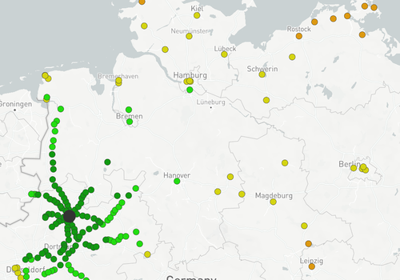

----------------------

## AB-Street

A/B-Street kann das städtische Straßensystem samt Verkehr simulieren. Es soll eine Auseinandersetzung mit dem lokalen Verkehrssystem ermöglichen. Bestehende Stadtplanungssoftware ist entweder proprietär oder schwer zu bedienen. A/B Street will leicht zugänglich sein, indem es ein unterhaltsames, fesselndes Spiel ist. 

| Projekt-Ursprung:   | London / DemocracyLab (2018) |
| :------------- |:-------------|
| Technologien: | interaktive Webseite mit RUST, Cargo, OSM |
| Kategorie & Lizenz:   | Mobilität / Apache-2.0 license |
| Status:   |  :heavy_check_mark:   Live |
| Benötigte Hilfe:  | Deployment für Münster |
| Quellcode:   | https://github.com/a-b-street/abstreet |

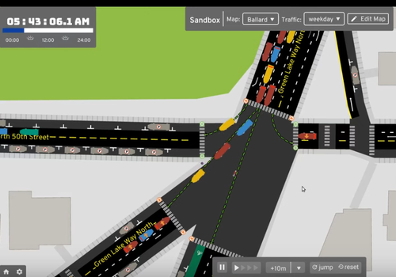

----------------------

## Blutspende-App UKM Münster

| Projekt-Ursprung:   | Münster / Münsterhack (10/2021) |
| :------------- |:-------------|
| Technologien: | App mit Flutter, Django, Firebase |
| Kategorie & Lizenz:   | Gesundheit / Creative Commons Public License - CCPL|
| Status:   |  :x:    |
| Benötigte Hilfe:  | Klären wie der Stand ist, wie es weiter geht |
| Quellcode:   | https://github.com/maxluetkemeyer/blood-donation-app |

----------------------

## Busradar

Live-Anzeige der aktuellen Positionen aller Stadtwerke-Busse in Münster.

| Projekt-Ursprung:   | Münster / CodeForGermany (09/2019) |
| :------------- |:-------------|
| Technologien: | Webseite (statisch) mit React, Mapbox GL JS, Deck.gl |
| Kategorie & Lizenz:   | Mobilität / --|
| Status:   |  :heavy_check_mark:   Live |
| Benötigte Hilfe:  | Weitere Funktionen einbauen |
| Quellcode:   | https://github.com/codeformuenster/busradar |

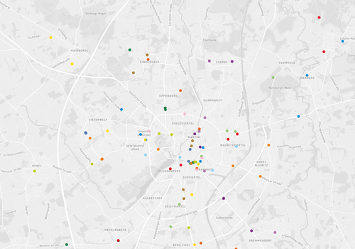

----------------------

## Data Inspire Me

Das Münster "Zahlen-Quiz" - Ein Münsterhack-Teilnehmer-Team hat dieses kurzweilige Quiz entwickelt, bei dem man testen kann, wie gut man sich mit den Zahlen, Daten und Fakten rund um Münster auskennt.

| Projekt-Ursprung:   | Münster / Münsterhack (10/2021) |
| :------------- |:-------------|
| Technologien: | Webseite (statisch) mit Flutter |
| Kategorie & Lizenz:   | Unterhaltung / MIT License|
| Status:   |  :heavy_check_mark:   Live |
| Benötigte Hilfe:  | Weitere Quizfragen eingeben bzw. einbauen |
| Quellcode:   | https://gitlab.com/data-inspire-me/data-inspire-me |

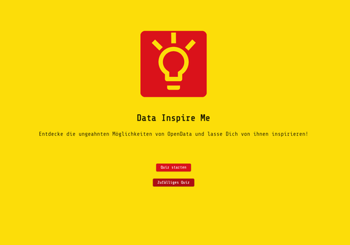

----------------------

## Datenwaben

Die moderne Art ein Datenportal darzustellen: Pro Datensatz wird eine Wabe dargestellt. Mit einem bunten Hintergrund und kurzem Text können sowohl statische als auch Live-Daten angezeigt werden.

| Projekt-Ursprung:   | Berlin / ROGL () |
| :------------- |:-------------|
| Technologien: | Alternatives Datenportal mit JavaScript, PHP, CSS, HTML, APIs |
| Kategorie & Lizenz:   | Demokratie, Politik / MIT License|
| Status:   |  :heavy_check_mark:   Live |
| Benötigte Hilfe:  | Die Community müsste unterstützt werden, um Zeit und Raum zu haben, um neue Ideen zu entwickeln – oder ausreichend Interesse und Kreativität der Plattformbetreiber könnte zu neuen Ideen führen. Außerdem fehlt eine vollständige Dokumentation sowie ein Automatismus. Die Plattform kann zwar mit mehreren Metadatenformaten arbeiten, aber eine Standardisierung fehlt. |
| Quellcode:   | https://github.com/tursics/data-dashboard |

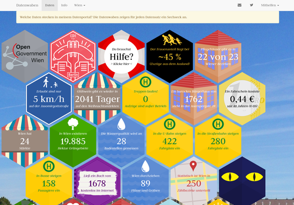

----------------------

## EventFahrplan

Eine Android-App um Programmpläne für große Veranstaltungen bereitzustellen – grundsätzlich ein Whitelabel-Projekt, das für alle denkbaren Veranstaltungen angepasst werden kann, derzeit wird es vor allem genutzt bei Chaosveranstaltungen.

| Projekt-Ursprung:   | Chaos Communication Camp / ROGL (2011) |
| :------------- |:-------------|
| Technologien: | Android-App mit Kotlin, Java, Dateninput über frab/Pretalx |
| Kategorie & Lizenz:   | Gemeinschaft, Veranstaltungen / Apache-2.0 license|
| Status:   |  :heavy_check_mark:   Live |
| Benötigte Hilfe:  | Personelle Ressourcen, um das Projekt langfristig zu unterstützen. Nur kurzfristige Finanzierungen wie beispielsweise über den Prototypefund helfen nicht. Aktuell wird das Projekt ausschließlich in der Freizeit weiterentwickelt, dauerhaft übersteigt das aber die Aufwandskosten. |
| Quellcode:   | https://github.com/EventFahrplan/EventFahrplan |

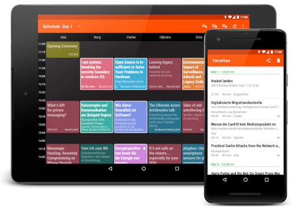

----------------------

## Geoserver "Masterportal"

In der Freien und Hansestadt Hamburg kommt es immer dann zum Einsatz, wenn webbasierte Kartenanwendungen benötigt werden – als eigenständige Anwendung oder als Teil einer E-Government-Lösung. Auch in anderen Städten und Kreisen wird das Masterportal eingesetzt. Das Masterportal ist Open-Source-Software.

| Projekt-Ursprung:   | Hamburg / CodeForGermany (2015) |
| :------------- |:-------------|
| Technologien: | Webseite (statisch) mit  |
| Kategorie & Lizenz:   | Sonstiges / MIT License |
| Status:   |  :heavy_check_mark:   Live |
| Benötigte Hilfe:  | Für Münster deployen |
| Quellcode:   | https://bitbucket.org/geowerkstatt-hamburg/masterportal/src/dev/ |

----------------------

## Gieß den Kiez

Auf dieser Plattform kannst Du Dich über Bäume in Deiner Nachbarschaft und ihren Wasserbedarf informieren. Du kannst einzelne Bäume adoptieren und markieren, wenn Du sie gegossen hast.

| Projekt-Ursprung:   | Berlin / Citylab Berlin (05/2020) |
| :------------- |:-------------|
| Technologien: | Webseite (dynamisch) mit AWS, Docker PostgresDB + Postgis, Vercel.com, Auth0.com, Mapbox, Appstores |
| Kategorie & Lizenz:   | Umwelt / MIT License |
| Status:   |  :heavy_check_mark:   Live |
| Benötigte Hilfe:  | Für Münster deployen |
| Quellcode:   | https://github.com/technologiestiftung/giessdenkiez-de |

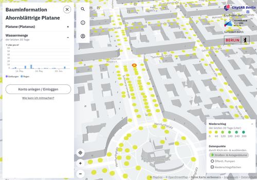

----------------------

## Gießt Kölle

Mit dieser Web-Karte kannst Du Dich über den Wasserbedarf der Bäume in deiner Nachbarschaft informieren und Deinen Nachbar*innen mitteilen ob Du die Bäume gegossen hast.

| Projekt-Ursprung:   | Köln / CodeForGermany (2020) |
| :------------- |:-------------|
| Technologien: | Webseite mit JavaScript, HTML, Python, OpenLayers6 |
| Kategorie & Lizenz:   | Umwelt / BSD-2-Clause license |
| Status:   |  :heavy_check_mark:   Live |
| Benötigte Hilfe:  | Für Münster umsetzen |
| Quellcode:   | https://github.com/codeforcologne/giesstKoelle |

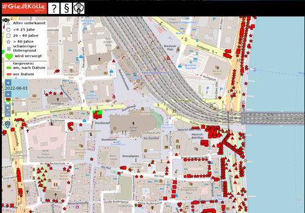

----------------------

## Kita-Standorte - stadtweite Analyse

Informationen über Kitas (Kindertagesstätten) in Berlin werden per explorative Datenanalyse betrachtet, dann mit Bevölkerungsdaten zusammengeführt, um Geolocation-Karten zu erstellen.

| Projekt-Ursprung:   | Berlin / CodeForGermany (09/2020) |
| :------------- |:-------------|
| Technologien: | Webseite (statisch) mit Python, Juypter Notebook |
| Kategorie & Lizenz:   | Familie / MIT License |
| Status:   |  :heavy_check_mark:   Live |
| Benötigte Hilfe:  | Für Münster umsetzen |
| Quellcode:   | https://github.com/juanitorduz/website_projects/tree/master/Python |

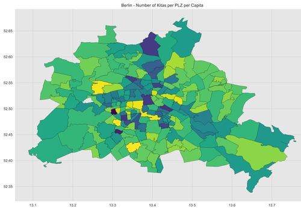

----------------------

## Klimaheroes

| Projekt-Ursprung:   | Münster / Münsterhack (09/2021) |
| :------------- |:-------------|
| Technologien: | Webseite (statisch) mit React native & Expo  (Frontend) bzw. Typescript (Backend) |
| Kategorie & Lizenz:   | Umwelt / --|
| Status:   |  :x:   unfertig |
| Benötigte Hilfe:  | KlimaHeroes programmiertechnisch auf dem Weg zur v1.0 unterstützen |
| Quellcode:   | https://github.com/KlimaHeroes |

----------------------

## Klimawatch

Klimawatch ist eine einfach zu verstehende Homepage, die zeigt, ob die kommunalen Klimaschutzbemühungen (noch) im Plan sind.

| Projekt-Ursprung:   | Münster / CodeForGermany (10/2019) |
| :------------- |:-------------|
| Technologien: | Webseite (statisch) mit Python, Docker, Hugo |
| Kategorie & Lizenz:   | Umwelt / Apache License, Version 2.0|
| Status:   |  :heavy_check_mark:   Live |
| Benötigte Hilfe:  | Daten weiterer Städte hinzufügen,  Pullrequests reviewen und mergen, ggf. weitere Funktionen programmieren. |
| Quellcode:   | https://github.com/codeformuenster/klimawatch/ |

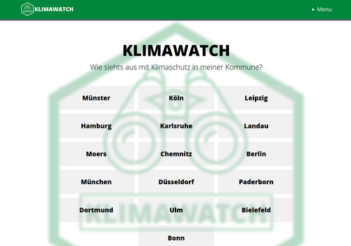

----------------------

## Mein-MS

Städtische Geoinformationen, die für Familien relevant sind, werden in einer übersichtlichen Karte präsentiert. Z.B. Kitas, Schulen, Spielplätze, Wickelplätze, öffentliche Toiletten, WLANs, etc..

| Projekt-Ursprung:   | Münster / CodeForGermany () |
| :------------- |:-------------|
| Technologien: | Dynamische Webseite mit Node.JS, React |
| Kategorie & Lizenz:   | Stadtleben / |
| Status:   |  :heavy_check_mark:   Live |
| Benötigte Hilfe:  | Frontend verbessern / Daten aktualisieren |
| Quellcode:   |  |

----------------------

## Meine Stadt Transparent

Prototyp eines neuen Ratsinformationssystems mit einer einer leicht verständlichen Weboberfläche und einer mächtigen Suche, die auch in einer großen Zahl an Rats-Dokumenten eine effektive Recherche ermöglicht.

| Projekt-Ursprung:   | München? / CodeForGermany (2017) |
| :------------- |:-------------|
| Technologien: | Dynamische Webseite mit Python, NodeJS, Datenbank (z.B. MariaDB), minio, Elasticsearch |
| Kategorie & Lizenz:   | Politik / MIT license |
| Status:   |  :x:   In Progress |
| Benötigte Hilfe:  | Schnittstellenprobleme OParl Münster beheben |
| Quellcode:   | https://github.com/meine-stadt-transparent/meine-stadt-transparent/ |

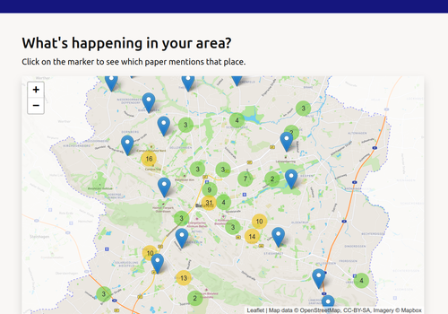

----------------------

## Münster Fair

Übersicht über Cafés, Restaurants und Shops, die einen besonderen Schwerpunkt auf nachhaltige Aspekte legen. 

| Projekt-Ursprung:   | Münster / CodeForGermany () |
| :------------- |:-------------|
| Technologien: | App mit React native & Expo (Frontend) bzw. Java Spring (Backend) |
| Kategorie & Lizenz:   | Freizeit / |
| Status:   |  :heavy_check_mark:   Live / Unterstützt von Privatpersonen aus Münster |
| Quellcode:   |  |

----------------------

## Offener Haushalt

| Projekt-Ursprung:   | Moers / CodeForGermany () |
| :------------- |:-------------|
| Technologien: | Webseite (statisch) mit  |
| Kategorie & Lizenz:   | Politik / |
| Status:   |  :x:   kaputt |
| Benötigte Hilfe:  | Dazu gibt eine Initiative vom Land NRW und vom KDN, dieses Thema neu anzugehen. Wenn man in der Richtung was machen möchte, dann mit dem KDN auseinandersetzen, da gibt es evtl. Unterstützungsmöglichkeiten. |
| Quellcode:   |  |

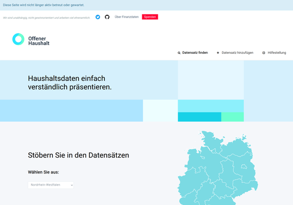

----------------------

## Open Smart City App

| Projekt-Ursprung:   | Solingen / CodeForGermany () |
| :------------- |:-------------|
| Technologien: | Webseite (statisch) mit  |
| Kategorie & Lizenz:   | Stadtleben / |
| Status:   |  :x:    |
| Quellcode:   |  |

----------------------

## Rats-Sitzplan

Interaktiver Rats-Sitzplan für's Handy. Nützlich z.B. wenn man zu einer Ratssitung geht und nachschauen möchte, wer gerade spricht.

| Projekt-Ursprung:   | Münster / CodeForGermany (12/2018) |
| :------------- |:-------------|
| Technologien: | Webseite (statisch) mit Python, Django |
| Kategorie & Lizenz:   | Politik / Apache License 2.0|
| Status:   |  :heavy_check_mark:   Live / Unterstützt von Open Data Münster |
| Benötigte Hilfe:  | Wartung & Pflege |
| Quellcode:   | https://github.com/codeformuenster/sitzplan-rat |

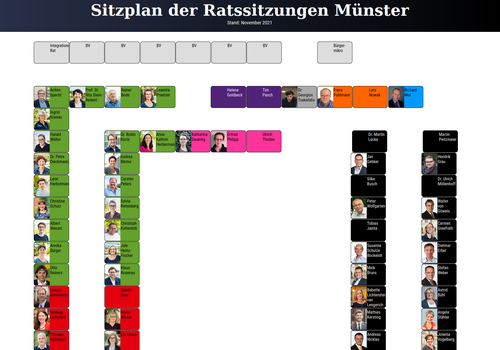

----------------------

## Schüler-Geschichtswettbewerb Münster

Die Idee vom Stadtarchiv, Beiträge des Schüler-Geschichtswettbewerb durch- suchbar zu machen, wurde beim Münsterhack & in einer Bachelorarbeit umgesetzt.

| Projekt-Ursprung:   | Münster / CodeForGermany (09/2020) |
| :------------- |:-------------|
| Technologien: | Dynamische Webseite mit Python, HTML, CSS |
| Kategorie & Lizenz:   | Bildung / GPL v3|
| Status:   |  :heavy_check_mark:   Live / Unterstützt von Stadtarchiv Münster |
| Benötigte Hilfe:  | Wartung & Pflege |
| Quellcode:   | https://github.com/codeformuenster/schueler-geschichtswettbewerb-muenster |

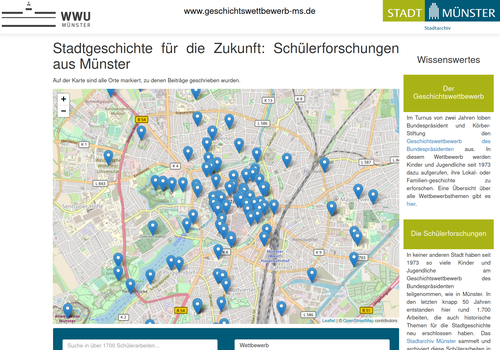

----------------------

## Stadtnavi bzw. Digitransit

Open-Source-Reiseplanungs-Anwendung, die mehrere Bereiche wie z. B. öffentliche Verkehrsmittel, Fußwege, Radverkehr und PKW-Routing zu einem modernen Routenplanung-Service kombiniert.

| Projekt-Ursprung:   | Herrenberg / Herrenberg () |
| :------------- |:-------------|
| Technologien: | Webseite mit JavaScript, Python, Docker, Shell, Ruby  |
| Kategorie & Lizenz:   | Mobilität / dual-licensed under the EUPL v1.2 and AGPLv3 license|
| Status:   |  :heavy_check_mark:   Live |
| Quellcode:   | https://github.com/stadtnavi/ |

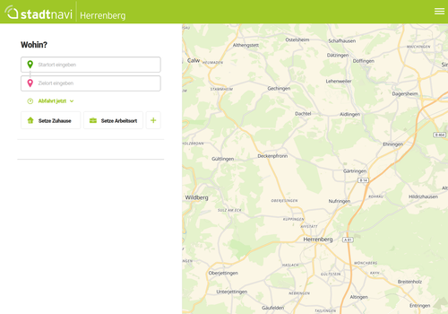

----------------------

## Stadtradeln-Heatmap

Diese Visualisierung zeigt, wo am meisten Fahrrad gefahren wird. Diese wurde errechnet aus den täglichen Radstrecken, die während der "Stadtradeln"-Aktion von Freiwilligen TeilnehmerInnen aufgezeichnet wurden.

| Projekt-Ursprung:   | Münster / CodeForGermany (2017) |
| :------------- |:-------------|
| Technologien: | Webseite (statisch) mit HTML, Javascript |
| Kategorie & Lizenz:   | Mobilität / --|
| Status:   |  :heavy_check_mark:   Live |
| Benötigte Hilfe:  | Wartung & Pflege |
| Quellcode:   | https://github.com/codeformuenster/stadtradeln-vis |

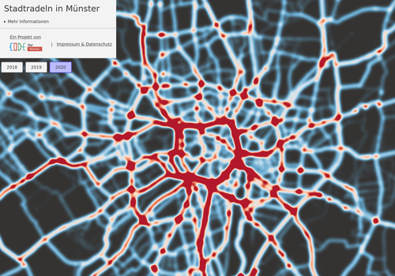

----------------------

## Straßennamen männlich vs. weiblich

| Projekt-Ursprung:   | Magdeburg / CodeForGermany (2020) |
| :------------- |:-------------|
| Technologien: | Webseite (statisch) mit Leaflet, Shell, Javascript |
| Kategorie & Lizenz:   | Gesellschaft / MIT License|
| Status:   |  :heavy_check_mark:   Live |
| Benötigte Hilfe:  | Für Münster deployen |
| Quellcode:   | https://github.com/code-for-magdeburg/streetnames-md |

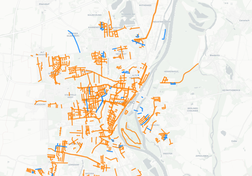

----------------------

## Umweltzone

Diese Android-App bietet deutschlandweit Informationen zu Umweltzonen und ihrer exakten geographischen Lage. Wird z.B. genutzt von Menschen mit alten Autos, Wohnwagen etc.

| Projekt-Ursprung:   |  / ROGL (2013) |
| :------------- |:-------------|
| Technologien: | App mit Java, Kotlin |
| Kategorie & Lizenz:   | Bürgerservice / GPL v3|
| Status:   |  :heavy_check_mark:   Live |
| Benötigte Hilfe:  | Es fehlen vor allem Daten. Zwar funktioniert der Prototyp, aber für langfristige Stabilität muss es maschinenlesbare Geodaten geben. Die Hälfte der Arbeit ist nicht Programmierarbeit, sondern Datenbeschaffung und -aufbereitung und Kommunikation. Zu jeder in der App vorhandenen Stadt besteht über Jahre Telefonkontakt. |
| Quellcode:   | https://bitbucket.org/tbsprs/umweltzone/src/master/ |

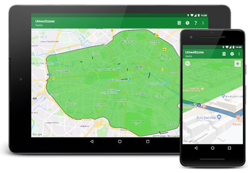

----------------------

## Visualisierung von Sanierungsstau

Die Anwendung zeigt gemeldete Sanierungsbedarfe bei Schulgebäuden (Stand 2016 in Berlin). Die Daten stammen von der Senatsverwaltung für Bildung, Jugend und Wissenschaft, von der sie auch derzeit einer Plausibilitätsprüfung unterzogen werden. 

| Projekt-Ursprung:   | Berlin / CodeForGermany (2016) |
| :------------- |:-------------|
| Technologien: | Webseite (statisch) mit  |
| Kategorie & Lizenz:   | Bildung / |
| Status:   |  :heavy_check_mark:   Live |
| Benötigte Hilfe:  | Daten recherchieren und für Münster deployen |
| Quellcode:   | https://github.com/tursics/schulsanierung |

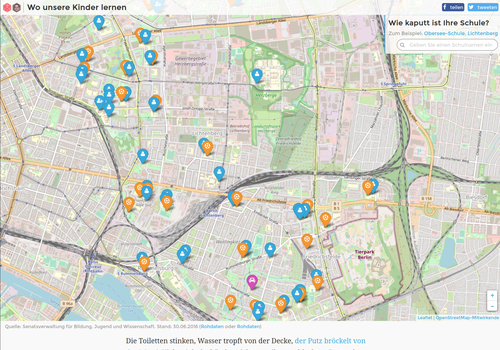

----------------------

## Was steckt in meinem Leitungswasser

Übersichtliche Darstellung der Inhaltsstoffe des lokalen Leitungswassers und Vergleich mit Mineralwasser.

| Projekt-Ursprung:   | Heilbronn / CodeForGermany (2014) |
| :------------- |:-------------|
| Technologien: | Webseite (statisch) mit HTML, CSS |
| Kategorie & Lizenz:   | Gesundheit / MIT License |
| Status:   |  :heavy_check_mark:   Live |
| Benötigte Hilfe:  | Weiterentwickeln / Aktualisieren der Daten für Münster |
| Quellcode:   | https://github.com/opendata-heilbronn/trinkwasser |

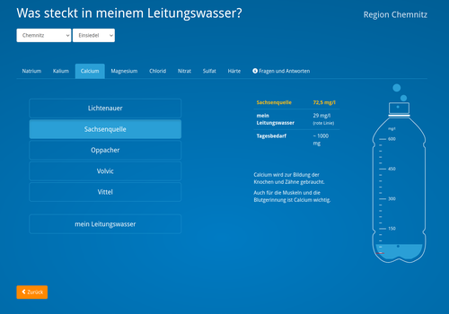

----------------------

## Wo ist Testzentrum

| Projekt-Ursprung:   | Leipzig / CodeForGermany () |
| :------------- |:-------------|
| Technologien: | Webseite (statisch) mit HTML, CSS, Node.js, Python |
| Kategorie & Lizenz:   | Gesundheit / |
| Status:   |  :heavy_check_mark:   Live |
| Benötigte Hilfe:  | Daten recherchieren und für Münster deployen |
| Quellcode:   | https://github.com/CodeforLeipzig/wo-ist-testzentrum |

